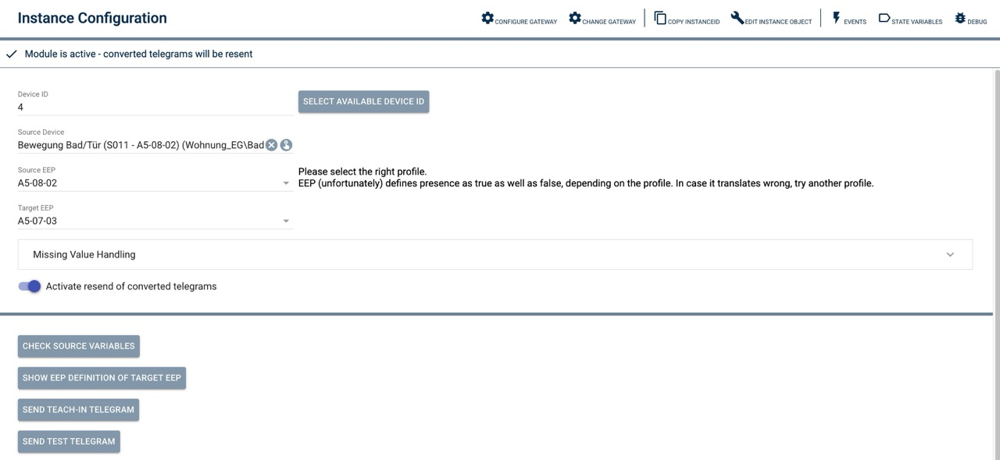

des PIR-Status-Bit invertiert werden.

# Motion Sensors
Simulation of EnOcean motion & illumination sensors

### Table of Contents

1. [Features](#1-features)
2. [Requirements](#2-requirements)
3. [Software Installation](#3-software-installation)
4. [Setting up Instances in IP-Symcon](#4-setting-up-instances-in-ip-symcon)
5. [Status Variables and Profiles](#5-status-variables-and-profiles)
6. [WebFront](#6-webfront)
7. [PHP Command Reference](#7-php-command-reference)

### 1. Features

This module sends EnOcean motion, illumination, temperature, voltage, and occupancy button telegrams.

It supports the following EEPs:
* A5-07-01
* A5-07-02
* A5-07-03
* A5-08-01
* A5-08-02
* A5-08-03

### 2. Requirements

* IP-Symcon version 7.1 or higher
* Existing "real" motion sensors to provide source values for PIR status, illumination, temperature, voltage, and occupancy button

### 3. Software Installation

* Install the 'EnOcean Converters' module via the Module Store.
* Alternatively, add the following URL to Module Control:
  https://github.com/AllardLiao/EnOceanConverter.git

### 4. Setting up Instances in IP-Symcon

Under 'Add Instance', you can find the 'EnOcean Converters Motion Sensor' module using the quick filter.  
For more information on adding instances, see the [Instance Documentation](https://www.symcon.de/service/dokumentation/konzepte/instanzen/#Instanz_hinzufügen).

__Configuration Page__:

| Name            | Description                                                    |
|-----------------|----------------------------------------------------------------|
| Device ID       | ID of the simulated device                                     |
| Source Device   | ID of the device from which the source values are taken        |
| Source EEP      | EEP of the source device                                       |
| Target EEP      | EEP with which the telegram should be sent                     |
| Addtl. Values   | If the target EEP requires values not provided by the source, a backup value can be set here |
| Activate        | Enable to send telegrams                                       |

### 5. Status Variables and Profiles

Status variables are automatically created depending on the selected target EEP. Deleting individual variables may cause malfunctions.

The source EEP mainly affects how the PIR status bit is interpreted.  
According to the EEP, PIR status in A5-07 and A5-08 is encoded inversely. If no EEP source device is selected, the interpretation of the PIR status bit can be inverted here.

#### Status Variables

Name         | Type    | Description
------------ | ------- | -----------------------------
Presence     | bool    | PIR / Presence
Illumination | int     | Brightness (Lux)
Temperature  | float   | Temperature (°C)
Voltage      | float   | Supply Voltage (V)
Occ. button  | bool    | Occupancy Button

#### Profiles

Name          | Type
------------- | -----------------------------
~Motion       | Motion yes/no
~Temperature  | Temperature (°C)
~Illumination | Illumination (Lux)
~Volt         | Voltage (V)
~Switch       | Button pressed/released

### 6. Visualization

No special functionality in the visualization.

### 7. PHP Command Reference

Keine aufrufbaren Funktionen
